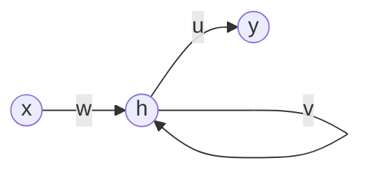

# Simple recurrent neural network, single hidden node
## Model



```math a^t = wx^t + vh^{t-1} + b \\```
```math a^0 = wx^0 + b \\```
```math h^t = \sigma(a^t) \\```
```math \hat{y}^t = uh^t + d```

where $\sigma$ is the sigmoid function.

## Loss

Loss is defined as the mean squared error over all time samples.

```math L = \frac{1}{T}\sum_{t=0}^TL^t```
```math L^t = \frac{1}{2}(y^t - \hat{y}^t)^2```

```math L = \frac{1}{T}\sum_{t=0}^TL^t```
```math L^t = \frac{1}{2}(y^t - \hat{y}^t)^2```

## Gradients
### $d$
<hr>

```math
\begin{aligned}
    \frac{\partial L^t}{\partial d} & = \frac{\partial L^t}{\partial \hat{y}^t} \cdot \frac{\partial \hat{y}^t}{\partial d} \\
    & = -(y^t - \hat{y}^t)
\end{aligned}
```

### $u$
<hr>
```math
\begin{aligned}
    \frac{\partial L^t}{\partial u} & = \frac{\partial L^t}{\partial \hat{y}^t} \cdot \frac{\partial \hat{y}^t}{\partial u} \\
    & = -(y^t - \hat{y}^t) h^t
\end{aligned}
```

### $b$
<hr>

```math \frac{\partial L^t}{\partial b} = \frac{\partial L^t}{\partial \hat{y}^t} \cdot \frac{\partial \hat{y}^t}{\partial h^t} \cdot \frac{\partial h^t}{\partial b}```

```math \frac{\partial h^t}{\partial b} = \frac{\partial h^t}{\partial a^t} \cdot \frac{\partial a^t}{\partial b}```

$a^t$ is dependent on $b$ both via $b$ itself as well as through $h^{t-1}$. Therefore:

```math \frac{\partial a^t}{\partial b} = v\frac{\partial h^{t-1}}{\partial b} + 1``

Putting it together:
```math \frac{\partial L^t}{\partial b} = -(y^t - \hat{y}^t) u \cdot \frac{\partial h^t}{\partial b}```
```math \frac{\partial h^t}{\partial b} = \sigma'(a^t) \left [ v\frac{\partial h^{t-1}}{\partial b} + 1 \right ]```
```math \frac{\partial h^0}{\partial b} = \sigma'(a^0)```

### $w$
<hr>

Analogously to $b$:

```math \frac{\partial L^t}{\partial w} = -(y^t - \hat{y}^t) u \cdot \frac{\partial h^t}{\partial w}```
```math \frac{\partial h^t}{\partial w} = \sigma'(a^t) \left [ v\frac{\partial h^{t-1}}{\partial w} + x^t \right ]```
```math \frac{\partial h^0}{\partial w} = \sigma'(a^0)x^t```

### $v$
<hr>

Analogously to $b$ and $w$:

```math \frac{\partial L^t}{\partial v} = \frac{\partial L^t}{\partial \hat{y}^t} \cdot \frac{\partial \hat{y}^t}{\partial h^t} \cdot \frac{\partial h^t}{\partial v}```
```math \frac{\partial h^t}{\partial v} = \frac{\partial h^t}{\partial a^t} \cdot \frac{\partial a^t}{\partial v}```

However calculation of $\frac{\partial a^t}{\partial v}$ now requires the product rule:

```math \begin{aligned}
    \frac{\partial a^t}{\partial v} = & v\frac{\partial h^{t-1}}{\partial v} + \frac{\partial v}{\partial v}h^{t-1} \\
    = & v\frac{\partial h^{t-1}}{\partial v} + h^{t-1} 
\end{aligned}```

Together:

```math \frac{\partial L^t}{\partial v} = -(y^t - \hat{y}^t) u \cdot \frac{\partial h^t}{\partial v}```
```math \frac{\partial h^t}{\partial v} = \sigma'(a^t) \left [ v\frac{\partial h^{t-1}}{\partial v} + h^{t-1} \right ]```
```math \frac{\partial h^0}{\partial v} = 0```